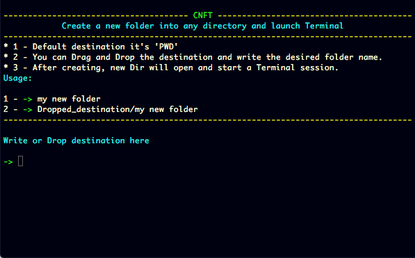

# CNFT
Create a new folder into any directory and start a Terminal session

##
Little tool useful when wanting start build sessions whitout having to switch around Finder directories

#

#
[Download](https://github.com/LAbyOne/CNFT/blob/main/CNFT.dmg)
